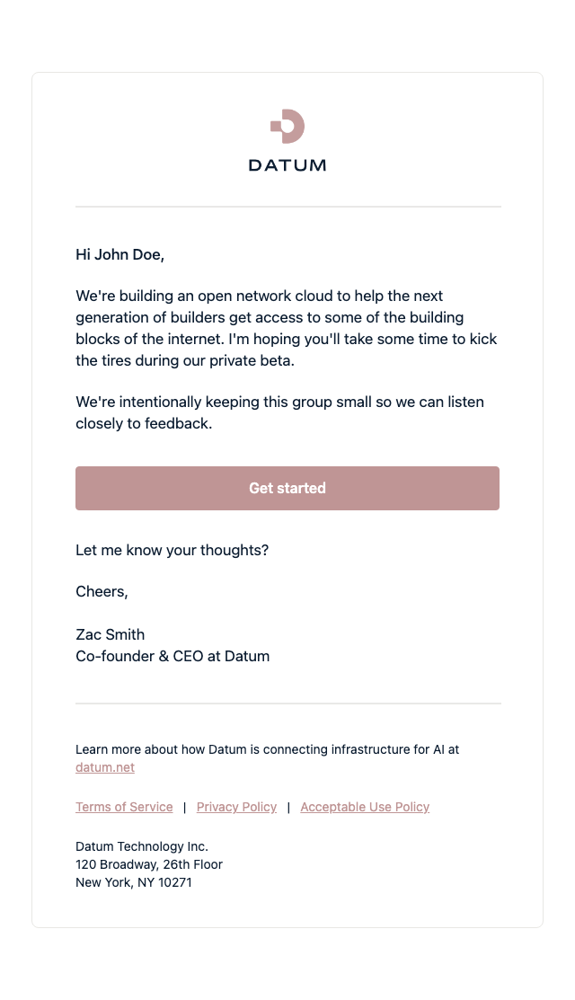
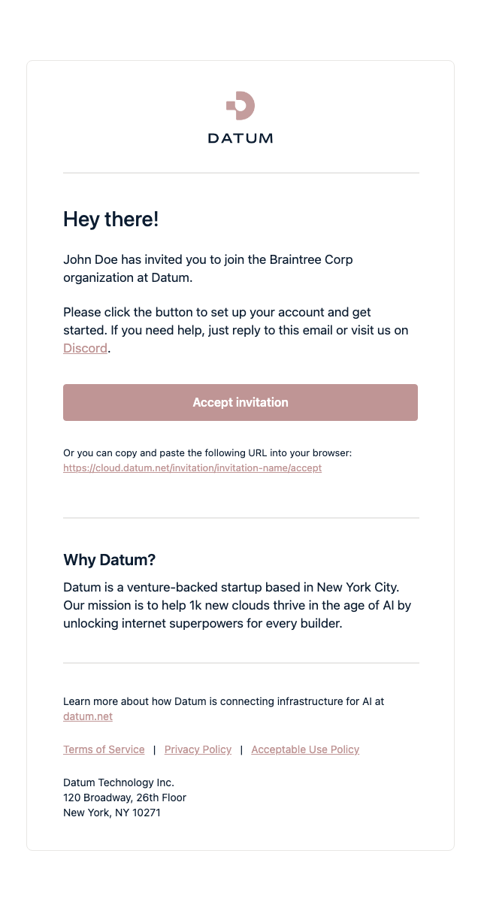
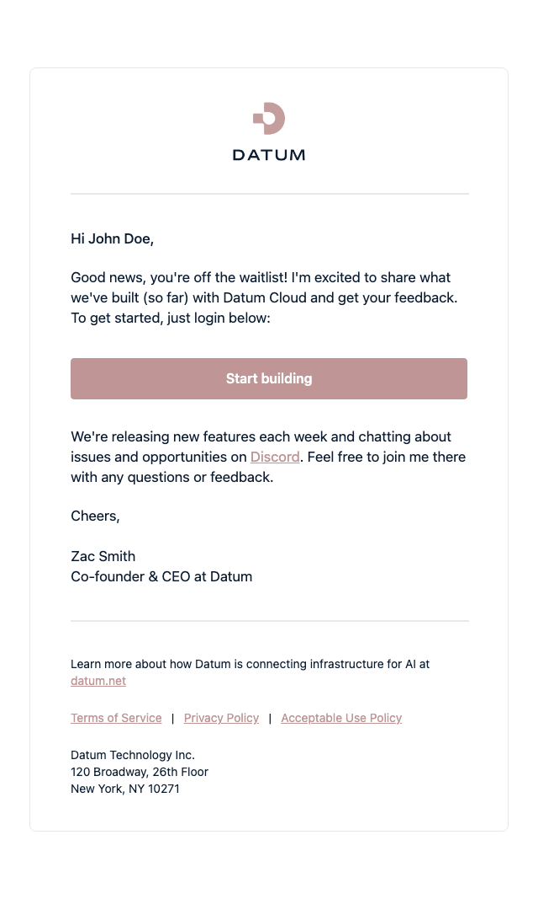
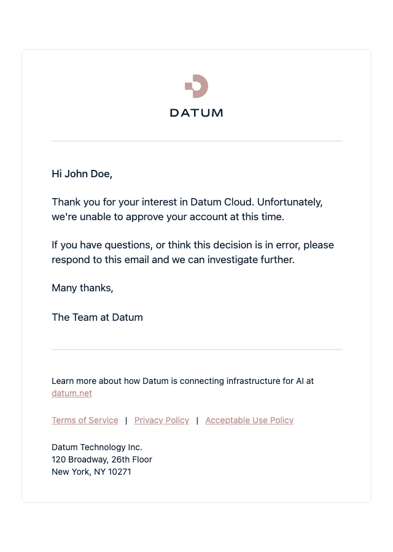
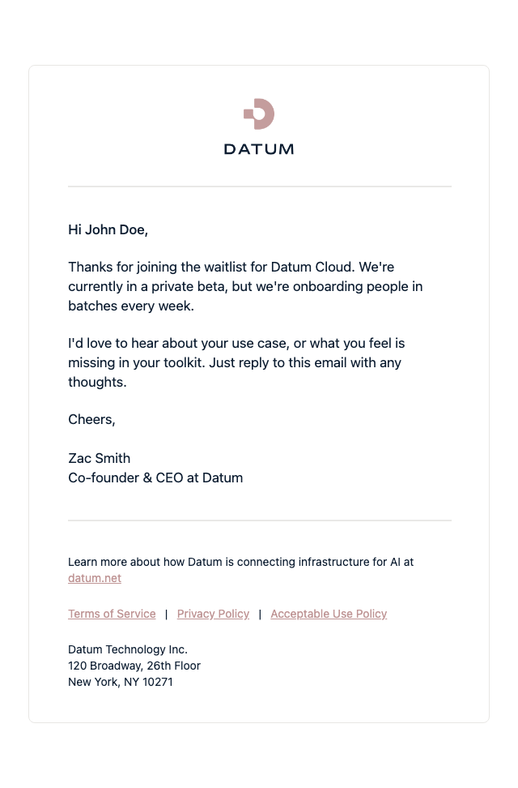
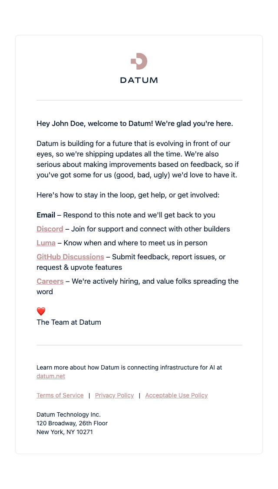
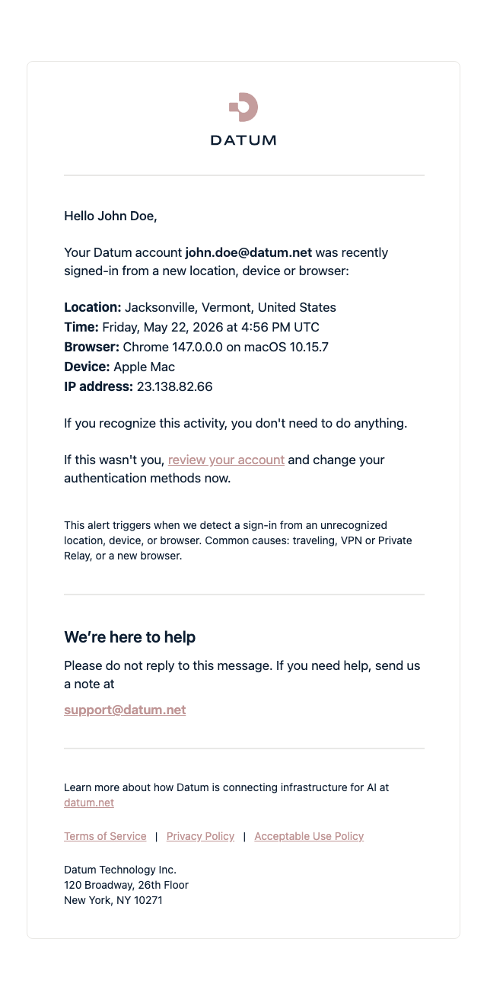

  

  <h1 align="center">Email Templates</h1>

For a lot of people, an email is the first — and sometimes only — impression they get of Datum. A waitlist confirmation, a welcome note, a heads-up that someone signed in from a new device: small moments, but they're often where trust is won or lost. This repo is where those emails live.

## Emails in this repo

Screenshots below are committed alongside each template change, so what you see is always what's actually in `main`.

<strong>Platform Invitation</strong> — the very first hello, inviting someone to join Datum's private beta <em>(click to preview)</em>

<strong>User Invitation</strong> — welcoming a new teammate into an organization on Datum <em>(click to preview)</em>

<strong>User Approved</strong> — the good news that someone's access request has been approved <em>(click to preview)</em>

<strong>User Rejected</strong> — a considerate no, when an application to Datum wasn't approved <em>(click to preview)</em>

<strong>User Waitlist</strong> — letting someone know they're in line and we haven't forgotten them <em>(click to preview)</em>

<strong>User Welcome</strong> — the front-door greeting for a brand-new Datum user <em>(click to preview)</em>

<strong>Suspicious Sign-in</strong> — a quiet tap on the shoulder when we spot a sign-in from somewhere unfamiliar <em>(click to preview)</em>

## Requesting a change

Need wording changed on an existing email, or a brand-new template entirely? You don't need to write any code — open an issue:

- **[Content / Wording Change Request](../../issues/new?template=content-change-request.yml)** — tweak the copy on an existing template.
- **[New Email Template Request](../../issues/new?template=new-template-request.yml)** — describe a new email and when it's sent.

If you're a member of the team, Claude automatically drafts a PR as soon as you submit the issue. Anyone else's request is triaged by a maintainer first, who adds the `ai-draft` label to have Claude take a pass at it — that same label re-triggers a run that failed or fell short. Either way, a draft PR still needs human review (copy, brand, and — for new templates — layout) before it merges.

Once that PR is merged, it's not live for real users yet — see [**"How do I actually release this?"**](./RELEASING.md) for the (no-code) steps to publish it.

## Contributing

Setup instructions and how to create or update a template live in [`CONTRIBUTING.md`](./CONTRIBUTING.md). The release process is documented in [`RELEASING.md`](./RELEASING.md).
